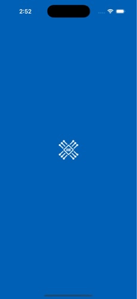
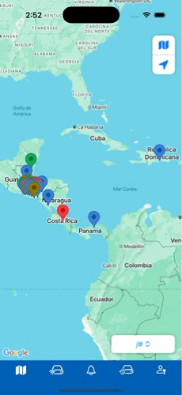
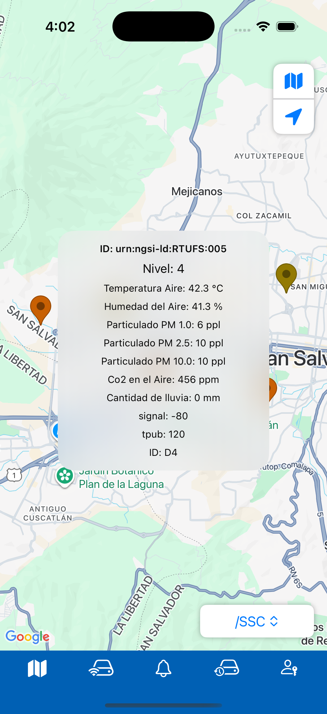
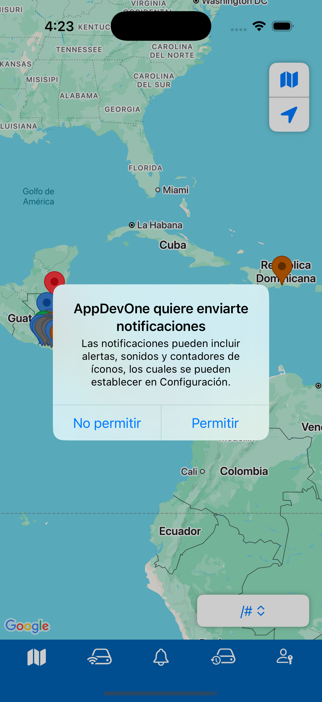
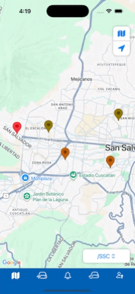

# 📱 App de Mapas con Rutas, Notificaciones y Reportes

> Demo de funcionalidades: abrir la app, cambiar entre múltiples rutas, recibir notificaciones en tiempo real, cambiar el tipo de mapa y abrir un reporte dentro de un WebView.

## Requisitos

* **Xcode 15+**, **iOS 18+**
* **Swift 5.9+**.
* SDK de mapas: **Google Maps iOS SDK** 

---

## Uso

### Recibir notificaciones

* Permite notificaciones en el primer arranque.

### Cambiar el tipo de mapa

* Toca el control **Tipo de mapa** y elige **Estándar / Satélite / Terreno / Híbrido**.

---

## Arquitectura (breve)

* **Capas**: `View (SwiftUI)` → `ViewModel (ObservableObject)` → `Service (Networking/WebSocket)`.
* **Estado**: `@StateObject` para ViewModels de larga vida, `@ObservedObject` en sub-vistas. Comunicación con `Combine`/`async`.
* **Tiempo real**: `URLSessionWebSocketTask` o librería equivalente; desacople por protocolo (p. ej. `EntitiesProtocol`).
* **Navegación**: `NavigationStack` + rutas tipadas; soporte para Deep Links.
* **Configuración**: `.xcconfig`/`Info.plist`/Variables de entorno para URLs y claves.

## Vista rápida

### Abrir app

  

### Cambiar entre múltiples rutas (mapa / navegación)

  

### Mostrar datos actualizados

  

### Recibir notificaciones

  

  

### Cambiar tipo de mapa

  

### Mostrar datos historicos

  

### Alterna tema entre dia/noche

  

### Navegacion entre las funcionalidades del APP

  

---

## Licencia

Este proyecto se distribuye bajo la licencia MIT (o la que corresponda). Consulta `LICENSE` para más información.
